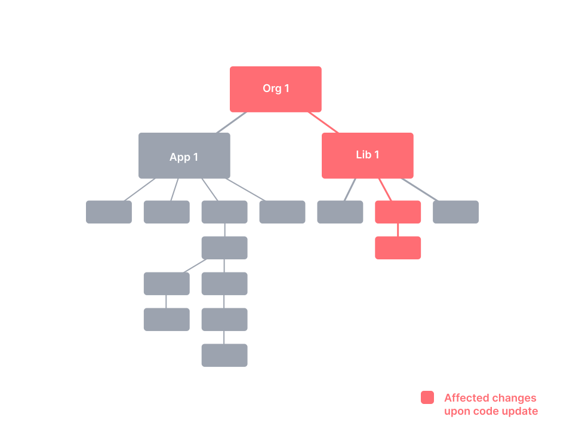

## Monorepo vs Polyrepo | Exploring Pants Monorepo Tool for Python
#### Introduction, An Overview of Build Tools, Monorepo vs Polyrepo, Exploring Pants Monorepo Tool for Python, Q&A and Knowledge Sharing


<small><strong>Time to Read:</strong> 30 Minutes</small>, <small><strong>Time to Present:</strong> 90 Minutes</small>
<br>
<small><strong>Speaker:</strong> Alireza Roshanzamir</small>
<br>
<small><strong>Keywords:</strong> Monorepo, Polyrepo, Continuous Integration, Collective code ownership, Pants, Bazel, Make, Build Tool, Code Generation, Dependency Management, Component, Living Documentation, Python</small>
<br><br>
<small style="color: darkred"><small>Press **"F"** to go fullscreen; some slides may not display properly otherwise.</small></small>

---
## Speaker
<table>
    <tr>
        <td></td>
        <td style="padding: 10px">
            <strong>Alireza Roshanzamir</strong>
            <br>
            Software Engineer, Independent Consultant
            <br>
            <br>
            Professional Experience:
            <ul>
                <li>Team Leader and Python Developer, <i>Mahsan</i></li>
                <li>C++ Developer, <i>Mahsan</i></li>
                <li>C# Developer (Web, Mobile), <i>Resaa</i></li>
            </ul>
            <br>
            Education:
            <ul>
                <li>M.Sc. in Artificial Intelligence, <i>Sharif University of Technology</i> | <small>2018 - 2020</small></li>
                <li>B.Sc. in Computer Software Engineering, <i>University of Tehran</i> | <small>2014 - 2018</small></li>
            </ul>
            <br>
            Social:
            <ul>
                <li>a.roshanzamir1996@gmail.com</li>
                <li><a href="https://linkedin.com/in/alireza-roshanzamir" target="_blank">linkedin.com/in/alireza-roshanzamir</a></li>
                <li><a href="https://alirezaroshanzamir.github.io" target="_blank">alirezaroshanzamir.github.io</a></li>
            </ul>
            <br>
        </td>
    </tr>
</table>

---
## An Overview of Build Tools


Build tools have a common core: **modeling dependencies**:  <!-- .element class="fragment fade-in-with-next custom" -->


------
### Continued: An Overview of Build Tools
Build tool types:
- <!-- .element class="fragment highlight-current-blue" --> Task-oriented
  - Explain the dependency network using a set of tasks
  - Examples: Ant, NAnt, MSBuild
  - Don't retain state between builds, making it unsuitable for C++ compilation
  - Work well with languages like C# because their compilers have built-in logic for incremental builds.
- <!-- .element class="fragment highlight-current-blue" --> Product-oriented
  - Explain things based on the products they generate
  - Examples: Make (also supports _phony targets_ like install), Bazel, Pants, and Buck (these three are almost mixed)
  - Maintain their state using timestamps on the generated files from each task.
- <!-- .element class="fragment highlight-current-blue" --> Mixed
  - Such as Rake

<details>
<summary>Note</summary>
Mention the _cookie targets_ in Make.
</details>

------
### An Overview of Build Tools: Make
A strong, **product-oriented** build tool that tracks dependencies and **only builds affected components**.

&shy;<!-- .element: class="fragment fade-in-with-next custom" -->But, **it's hard to debug** complex Makefiles. In larger codebases, teams often create a Makefile for each directory and use a top-level Makefile to run them **recursively**, a practice that's [considered problematic](https://accu.org/journals/overload/14/71/miller_2004/):
<table>
  <tr>
    <td></td>
    <td></td>
  </tr>
</table>

Some other drawbacks:  <!-- .element: class="fragment fade-in-with-next custom" -->
- OS specific (it depends on the shell)
- Whitespace can be important in some cases
- Doesn't support extensions


------
### An Overview of Build Tools: Ant
Ant's core is in Java, while its scripts are an **external DSL in XML**. This mix provides Ant with robust **cross-platform** capabilities:


Some shortcomings:  <!-- .element: class="fragment fade-in-with-next custom" -->
- &shy;<!-- .element class="fragment highlight-current-blue" -->**XML** is **not concise** or **enjoyable** for humans to read.
- &shy;<!-- .element class="fragment highlight-current-blue" -->There are **no real domain concepts** beyond tasks.
- &shy;<!-- .element class="fragment highlight-current-blue" -->You can't easily respond to questions like **"How many tests ran?"** or **"How long did they take?"**.
- &shy;<!-- .element class="fragment highlight-current-blue" -->Import and macrodef tasks support reuse but may be **confusing for novices**.

&shy;<!-- .element class="fragment fade-in" -->Ant files can become very long and disorganized due to these limitations, sometimes extending to **thousands of lines**.

------
### An Overview of Build Tools: NAnt and MSBuild
**NAnt** and **Ant** have a **similar syntax**, with only a few differences. **Microsoft** later introduced a variant called **MSBuild**, tightly **integrated into Visual Studio**, specializing in building **solutions**, handling dependencies, and managing projects:


------
### An Overview of Build Tools: Maven


&shy;<!-- .element: class="fragment fade-in-with-next custom" -->Maven simplifies Ant files by **assuming certain Java project layouts**. By favoring **"convention over configuration"**, it can handle various tasks like **build**, **deploy**, **test**, and **release** with just **one command**, often needing minimal XML configuration:
<table>
  <tr>
    <td></td>
    <td></td>
  </tr>
</table>

Some shortcomings:  <!-- .element: class="fragment fade-in-with-next custom" -->
- &shy;<!-- .element class="fragment highlight-current-blue" -->Projects **not following Maven's assumptions** can make achieving desired results **tricky**, **seen as a feature** by some.
- &shy;<!-- .element class="fragment highlight-current-blue" -->To extend it, **coding is necessary**, but it **offers plugins** for nearly every desired functionality.

------
### An Overview of Build Tools: Rake
Rake, the **main Ruby build tool**, started as an experiment to **mimic Make** using an **internal Ruby DSL**. It handles **tasks** and **dependencies**. Since the scripts are standard Ruby code, you can use it's versatility as a **general-purpose programming language**:
<table>
  <tr>
    <td></td>
    <td></td>
  </tr>
</table>

&shy;<!-- .element class="fragment fade-in" -->You can **refactor** and **modularize** builds in your regular development environment. Debugging is easy with the **standard Ruby debugger**.

Some disadvantages:  <!-- .element: class="fragment fade-in-with-next custom" -->
- You need to ensure a suitable runtime is available on your platform
- You have to interact with RubyGems

------
### An Overview of Build Tools: Buildr, Gradle
New-gen build tools like Buildr, Gradle, and Gantt use **real programming languages** for build scripts.

&shy;<!-- .element class="fragment fade-in" -->Buildr is **based on Rake**, so anything you can do in Rake, you can do in Buildr. Moreover, Buildr seamlessly **replaces Maven**, sharing the **same conventions like filesystem layout**, **artifact specs**, and **repositories**. You can also **use Ant tasks**, with no setup needed.

&shy;<!-- .element: class="fragment fade-in-with-next custom" -->Gradle was designed for **multi-project builds**, often **large in scale**. It relies on a series of build **tasks** that can run **serially** or in **parallel**. It also supports incremental builds:


&shy;<!-- .element class="fragment fade-in" -->If you're starting **a new Java project** or seeking an **alternative to Ant or Maven**, consider **Gradle** or Buildr with **DSLs in Groovy**.

------
### An Overview of Build Tools: Psake
Psake is an **internal DSL** written in **PowerShell**, which provides **task-oriented** dependency networks:


------
### An Overview of Build Tools: Bazel (Google), Buck (Facebook), Pants (Twitter)
Three of the most popular **Monorepo tools** and **declarative build systems**.

Common concepts are:
- **Goals and Commands:** build, test, lint, check, fmt, export, run, audit, clean, coverage, ...
- **Rules, Targets:** cc_library, python_source, java_source, docker_image, java_library, protobuf_source, ...
- **BUILD files**

```console
$ ./pants test ::
```

```console
$ ./pants test example:tests@interpreter_constraints=py2
```

```BUILD
# BUILD file

python_test(
  name="tests",
  source="tests.py",
  interpreter_constraints=parametrize(py2=["==2.7.*"], py3=[">=3.6"]),
)
```

&shy;<!-- .element class="fragment fade-in" -->They support **multiple programming languages**, **incremental builds**, **heavy and distributed caching**, **parallelization**, **code generation**, **dependency management and visualization**.

---
## Monorepo (Reference: <a href="https://monorepo.tools/">monorepo.tools</a>)
A monorepo is a **single repository** containing **multiple distinct projects**, with **well-defined relationships**:


------
### Monorepo != Monolith
A good monorepo is the opposite of monolithic:


------
### Polyrepo
A polyrepo is the current standard way of developing applications: **one repo per team, app, or project**. Typically, each repo has a **single build artifact** and a **simple build pipeline**.


The industry has moved to the polyrepo way of doing things for one big reason: **team autonomy**.

------
### Repository Management and Software Structure Organization Spectrums


------
### Polyrepo Drawbacks
- <!-- .element class="fragment highlight-current-blue" --> Cumbersome code sharing
  - To share code across repos, you'd likely create a repo for shared code (CI, tools, dependencies, versioning, etc.).
- <!-- .element class="fragment highlight-current-blue" --> Significant code duplication
  - Teams avoid the trouble of setting up a shared repo, creating their own versions of common services and components in each repo.
- Costly cross-repo changes to shared libraries and consumers  <!-- .element class="fragment highlight-current-blue" -->
- <!-- .element class="fragment highlight-current-blue" --> Inconsistent tooling
  - Each project uses its own set of commands for running tests, building, serving, linting, deploying, and so forth.

------
### Monorepo Benefits
- No overhead to create new projects  <!-- .element class="fragment highlight-current-blue" -->
- Atomic commits across projects  <!-- .element class="fragment highlight-current-blue" -->
- One version of everything  <!-- .element class="fragment highlight-current-blue" -->
- <!-- .element class="fragment highlight-current-blue" --> Developer mobility
  - Developers can confidently contribute to other teams' applications and verify that their changes are safe.

&shy;<!-- .element class="fragment fade-in" -->It is **more than code & tools**. It changes your **organization** and the **way you think about code**. By adding **consistency**, **lowering the friction in creating new projects** and performing **large scale refactorings**, by facilitating **code sharing** and **cross-team collaboration**, it enhances your organization's **efficiency**.

------
### Monorepo Tools
As your **workspace grows**, the tools have to help you keep it **fast**, **understandable** and **manageable**:


------
### Monorepo Tools Features: Fast
<table>
  <tr>
    <td>
      Local computation caching
      <br>
      
    </td>
    <td>
      Local task orchestration
      <br>
      
    </td>
    <td>
      Distributed computation caching
      <br>
      
    </td>
  </tr>
  <tr class="simple">
    <td>
      Distributed task execution
      <br>
      
    </td>
    <td>
      Detecting affected projects/packages
      <br>
      
    </td>
    <td>Transparent remote execution</td>
  </tr>
</table>

------
### Monorepo Tools Features: Understandable

<table>
  <tr>
    <td>
      Workspace analysis
      <br>
      
    </td>
    <td>
      Dependency graph visualization
      <br>
      
    </td>
  </tr>
</table>

------
### Monorepo Tools Features: Managable

<table>
  <tr>
    <td>
      Source code sharing
      <br>
      
    </td>
    <td>
      Consistent tooling
      <br>
      
    </td>
  </tr>
  <tr class="simple">
    <td>
      Code generation
      <br>
      
    </td>
    <td>
      Project constraints and visibility
      <br>
      
    </td>
  </tr>
</table>

------
### Monorepo Drawbacks
- Weak Multiple Languages Support  <!-- .element: class="fragment insides-fade-in-then-out" -->
  - The ideal monorepo tool for one programming language may not be suitable for others.  <!-- .element: class="fragment fade-in-then-semi-out" -->
  - But, most monorepo tools support internal and external plugins.  <!-- .element: class="fragment fade-in-then-semi-out" -->
  - Git submodules can be an option for managing multiple languages in a monorepo.  <!-- .element: class="fragment fade-in-then-semi-out" -->
- VCS Tooling Challenges  <!-- .element: class="fragment insides-fade-in-then-out" -->
  - The complexity and size of the codebase, which makes it difficult to understand, search, scale, and maintain.  <!-- .element: class="fragment fade-in-then-semi-out" -->
  - Microsoft has released a Virtual File System (VFS) for Git to help manage the overload.  <!-- .element: class="fragment fade-in-then-semi-out" -->
- Limitations Around Access Control  <!-- .element: class="fragment insides-fade-in-then-out" -->
  - Your company may not want every engineer to have access to the entire codebase.  <!-- .element: class="fragment fade-in-then-semi-out" -->
  - GitHub and GitLab support CODEOWNERS file to define which team owns subdirectories in the repository.  <!-- .element: class="fragment fade-in-then-semi-out" -->
- Heavy Build Pipelines  <!-- .element: class="fragment insides-fade-in-then-out" -->
  - Many CI tools offer conditional stages based on directory changes, like SemaphoreCI's "change_in" and Jenkins' "changeset."  <!-- .element: class="fragment fade-in-then-semi-out" -->

---
## Sample Project Structure: JVM-Based/Maven

<table>
  <tr>
    <td></td>
    <td></td>
  </tr>
</table>

------
## Sample Project Structure: Pants

<pre style="font-size: 16px">
[project-name]/
  src/                 You can create a directory for each programming language.
    [project-name]/
  tests/
  examples/
    [example1-name]/
    [example2-name]/
    [example3-name]
    run.py
    BUILD
  docs/
    ...
    index.rst
    release.py
    build.py
    doctests.py
    enrich.py
    BUILD
  pants_plugins/
  dist/
  .azuredevops/
    pull_request_template/
      develop.md
      master.md
  .githooks/
    pre-commit
  .jenkins/
    ci.Jenkinsfile
  CHANGELOG.md
  CHANGELOG-fa.md
  requirements.txt
  requirements.lock
  BUILD
  pants.toml
  pyproject.toml
  pants*
</pre>

<details>
  <summary>Note</summary>
  <ul>
    <li>Put things together that change together.</li>
  </ul>
</details>

------
## Sample Project Structure: JVM-Based/Maven

<pre style="font-size: 20px">
[project-name]/
  common/
    terraform/
    service-parent-pom.xml
    service.Dockerfile
  libraries/
    library-1/
      src/            You can put the unit-test files next to the source files.
      pom.xml
      README.md
    library-2/
    library-3/
  services/
    service-1/
      src/
      terraform/
      pom.xml
      README.md
    service-2/
  terraform/
  tests/
    end-to-end/
    performance/
  Jenkinsfile
  README.md
</pre>

---
## Exploring Pants Monorepo Tool for Python

---
## Q&A and Knowledge Sharing
